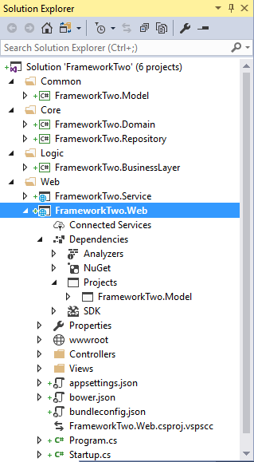
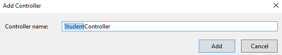

# n-layered Architecture using ASP.NET Core Web Application, Web API, Entity Framework Core, Generic Repository and Unit-of-Work #

### Introduction ###

This article covers following things –

- Implementation of n-layered architecture in .Net Core with following layers -
	- Domain layer
		- .Net Core Class Library project
		- It holds Entity Framework Core Context and Entities
	- Repository layer
		- .Net Core Class Library project
		- It holds code for CRUD operations using Generic Repository and Unit-of-Work patterns
	- Business layer
		- .Net Core Class Library project
		- It holds business logic
		- Business layer calls methods of Repository layer for CRUD operations. Repository layer returns data in Domain layer Entities. Business layer perform additional logic and returns data in Model objects to the Service layer
	- Model layer
		- .NetStandard Class Library project
		- In future we will be extending this example to work with Xamarin and will reuse our Model layer (this being .NetStandard Class Library project)
		- Model is shared between Business and Service layer. Business layer returns data in Model objects to the Service layer
	- Service layer
		- ASP.NET Core Web Application (.Net Core) Web API project
		- Clients (Web Application in our case) will call Service layer methods to fetch data. Service layer in turn calls Business layer for processing
		- Implements disconnected architecture
	- Web layer
		- ASP.NET Core Web Application (.Net Core) project
		- Uses MVC (Model-View-Controller) pattern and holds the presentation layer logic
		- For Models, it uses Model layer objects
- Environment setup
- Creating Database for tutorial
- Using Entity Framework Core
- Using Generic Repository and Unit-of-Work patterns

### Environment Setup ###

- We are using Visual Studio 2017 Preview (2) for this example. Please install Visual Studio 2017 Preview (2). Pay attention to the components selected in Summary section below
	

### Basic Solution and Project creation ###

- Create a new ASP.NET Core Web Application (.Net Core) project (FrameworkTwo.Web) with solution name FrameworkTwo
	

- Select Web Application template with ASP.NET Core 1.1
	

- We will have below structure

	

- Add a Web API project to the solution. Add ASP.NET Core Web Application (.Net Core) project (FrameworkTwo.Service)
	

- Select Web API template with ASP.NET Core 1.1
	

- Create below structure in the solution
	- Move FrameworkTwo.Service (Web API) and FrameworkTwo.Web (Web Application) projects to Web folder
	- Add folders Common, Core and Logic

		

- Add a Class Library (.NET Core) project (FrameworkTwo.Domain) to Core folder in the solution
	

- Add a Class Library (.NET Core) project (FrameworkTwo.Repository) to Core folder in the solution
	

- Add a Class Library (.NET Core) project (FrameworkTwo.BusinessLayer) to Logic folder in the solution
	

- Add a Class Library (.NET Standard) project (FrameworkTwo.Model) to Common folder in the solution
	

- Build the solution

	

### Adding Project References ###

- Add FrameworkTwo.Domain project reference in FrameworkTwo.Repository project

	

- Add FrameworkTwo.Domain, FrameworkTwo.Model, FrameworkTwo.Repository project reference in FrameworkTwo.BusinessLayer project

	

- Add FrameworkTwo.BusinessLayer, FrameworkTwo.Domain, FrameworkTwo.Repository project reference in FrameworkTwo.Service project

	

- Add FrameworkTwo.Model project reference in FrameworkTwo.Web project

	

### Adding NuGet Packages ###

- Using NuGet Package Manager, add below packages to FrameworkTwo.Domain project. These packages are required for integrating EntityFrameworkCore in the project

	- Add Microsoft.EntityFrameworkCore.SqlServer package
		

	- Add Microsoft.EntityFrameworkCore.SqlServer.Design package
		

	- Add Microsoft.EntityFrameworkCore.Design package
		

	- Add Microsoft.EntityFrameworkCore.Tools package
		

- Using NuGet Package Manager, add Microsoft.EntityFrameworkCore.SqlServer packages to FrameworkTwo.Repository project. These packages are required for integrating EntityFrameworkCore in the project
	

- Using NuGet Package Manager, add below packages to FrameworkTwo.Service project

	- Add Microsoft.EntityFrameworkCore package
		

	- Add Microsoft.EntityFrameworkCore.SqlServer package
		

- Build the solution

	

### Setting up the Database ###

- Connect to (localdb)\MSSQLLocalDb server from SQL Server 2014 Management Studio
	

- Create a new Database (FrameworkTwo) with default settings
	

- Create Student table. Below is the CREATE script of the table

	>     /****** Object:  Table [dbo].[Student]    Script Date: 5/26/2017 11:58:16 AM ******/
	>     SET ANSI_NULLS ON
	>     GO
	>     
	>     SET QUOTED_IDENTIFIER ON
	>     GO
	>     
	>     CREATE TABLE [dbo].[Student](
	>     	[StudentId] [int] NOT NULL,
	>     	[Name] [nvarchar](100) NULL,
	>      CONSTRAINT [PK_Student] PRIMARY KEY CLUSTERED 
	>     (
	>     	[StudentId] ASC
	>     )WITH (PAD_INDEX = OFF, STATISTICS_NORECOMPUTE = OFF, IGNORE_DUP_KEY = OFF, ALLOW_ROW_LOCKS = ON, ALLOW_PAGE_LOCKS = ON) ON [PRIMARY]
	>     ) ON [PRIMARY]
	>     
	>     GO

- Insert some data in Student table

	>     SELECT [StudentId], [Name] FROM [FrameworkTwo].[dbo].[Student]

	

### Adding Entity Framework Connection ###

- From FrameworkTwo.Domain project open Package Manager Console and run below command to scaffold the Context and Entities from Student database

	>     Scaffold-DbContext "Server=(localdb)\mssqllocaldb;Database=FrameworkTwo;Trusted_Connection=True;" Microsoft.EntityFrameworkCore.SqlServer

	

- FrameworkTwo.Domain project looks like below with FrameworkTwoContext class and Student class
	

### Creating Generic Repository and Unit of Work ###

- Details around each Generic Repository and Unit of Work classes is detailed in my other tutorial – <a href="https://github.com/AmanpreetSingh-GitHub/Architecture-FrameworkOne">FrameworkOne</a>

- In FrameworkTwo.Repository project, first add folder Interface. Then add a new interface file IGenericRepository

	

- Code for IGenericRepository interface is below

	>     namespace FrameworkTwo.Repository.Interface
	>     {
	>         public interface IGenericRepository<T> where T : class
	>         {
	>             T GetItem(Expression<Func<T, bool>> filter);
	>             IQueryable<T> GetAll();
	>             void Save(T entity);
	>             void Delete(T entity);
	>             void Update(T entity, params Expression<Func<T, object>>[] updatedProperties);
	>         }
	>     }

- In FrameworkTwo.Repository project, add a new interface file IUnitOfwork
	

- Code for IUnitOfWork interface is below
	>     namespace FrameworkTwo.Repository.Interface
	>     {
	>         public interface IUnitOfWork
	>         {
	>             FrameworkTwoContext DbContext { get; }
	>     
	>             int Save();
	>         }
	>     }

- In FrameworkTwo.Repository project, add a new class GenericRepository that implements IGenericRepository
	

- Code for GenericRepository class is below
	>     namespace FrameworkTwo.Repository
	>     {
	>         public class GenericRepository<T> : IGenericRepository<T> where T : class
	>         {
	>             protected FrameworkTwoContext _context;
	>     
	>             public GenericRepository(IUnitOfWork unitOfWork)
	>             {
	>                 _context = unitOfWork.DbContext;
	>             }
	>     
	>             public T GetItem(Expression<Func<T, bool>> filter)
	>             {
	>                 IQueryable<T> query = _context.Set<T>();
	>                 if (filter != null)
	>                 {
	>                     query = query.Where(filter);
	>                 }
	>                 return query.FirstOrDefault();
	>             }
	>     
	>             public IQueryable<T> GetAll()
	>             {
	>                 IQueryable<T> query = _context.Set<T>();
	>                 return query;
	>             }
	>     
	>             public void Save(T entity)
	>             {
	>                 _context.Set<T>().Add(entity);
	>             }
	>     
	>             public void Update(T entity, params Expression<Func<T, object>>[] updatedProperties)
	>             {
	>                 _context.Set<T>().Attach(entity);
	>                 if (updatedProperties.Any())
	>                 {
	>                     //update explicitly mentioned properties
	>                     foreach (var property in updatedProperties)
	>                     {
	>                         _context.Entry(entity).Property(property).IsModified = true;
	>                     }
	>                 }
	>             }
	>     
	>             public void Delete(T entity)
	>             {
	>                 _context.Set<T>().Remove(entity);
	>             }
	>         }
	>     }

- In FrameworkTwo.Repository project, add a class file UnitOfWork that implements IUnitOfWork
	

- Code for UnitOfWork class is below
	>     namespace FrameworkTwo.Repository
	>     {
	>         public class UnitOfWork : IUnitOfWork
	>         {
	>             private FrameworkTwoContext _context;
	>     
	>             public UnitOfWork(FrameworkTwoContext context)
	>             {
	>                 this._context = context;
	>             }
	>     
	>             public FrameworkTwoContext DbContext
	>             {
	>                 get
	>                 {
	>                     return this._context;
	>                 }
	>             }
	>     
	>             public int Save()
	>             {
	>                 return this._context.SaveChanges();
	>             }
	>     
	>             public void Dispose(bool disposing)
	>             {
	>                 if (disposing)
	>                 {
	>                     if (this._context != null)
	>                     {
	>                         this._context.Dispose();
	>                         this._context = null;
	>                     }
	>                 }
	>             }
	>     
	>             public void Dispose()
	>             {
	>                 Dispose(true);
	>                 GC.SuppressFinalize(this);
	>             }
	>         }
	>     }

### Creating Model classes ###

- In FrameworkTwo.Model project, add StudentModel class
	

- StudentModel class have two properties - StudentId and Name. This is replica of FrameworkTwo.Domain project’s Student class
	>     namespace FrameworkTwo.Model
	>     {
	>         public class StudentModel
	>         {
	>             public int StudentId { get; set; }
	>             public string Name { get; set; }
	>         }
	>     }

### Creating Business Layer classes ###

- In FrameworkTwo.BusinessLayer project, add Interface folder

	

- In FrameworkTwo.BusinessLayer, add IStudentLogic interface
	

- IStudentLogic code is below. It has one method to fetch student data
	>     namespace FrameworkTwo.BusinessLayer.Interface
	>     {
	>         public interface IStudentLogic
	>         {
	>             List<StudentModel> GetStudents();
	>         }
	>     }

- In FrameworkTwo.BusinessLayer, add StudentLogic class that implements IStudentLogic interface
	

- StudentLogic code is below. It has implementation of IStudentLogic interface methods
	>     namespace FrameworkTwo.BusinessLayer
	>     {
	>         public class StudentLogic : IStudentLogic
	>         {
	>             private IUnitOfWork unitOfWork;
	>             private IGenericRepository<Student> studentRepository;
	>     
	>             public StudentLogic(IUnitOfWork unitOfWork, IGenericRepository<Student> studentRepository)
	>             {
	>                 this.unitOfWork = unitOfWork;
	>                 this.studentRepository = studentRepository;
	>             }
	>     
	>             public List<StudentModel> GetStudents()
	>             {
	>                 List<Student> students = studentRepository.GetAll().ToList();
	>     
	>                 List<StudentModel> studentModels = new List<StudentModel>();
	>                 foreach (Student student in students)
	>                 {
	>                     StudentModel studentModel = new StudentModel()
	>                     {
	>                         StudentId = student.StudentId,
	>                         Name = student.Name
	>                     };
	>     
	>                     studentModels.Add(studentModel);
	>                 }
	>     
	>                 return studentModels;
	>             }
	>         }
	>     }

### Creating Web API Controller classes ###

- In FrameworkTwo.Service project add a new empty API Controller - StudentController
	
	

- StudentController code is below –
	- constructor – for setting up object references (using DI)
	- Get method – To fetch student data
	>     namespace FrameworkTwo.Service.Controllers
	>     {
	>         [Route("api/[controller]")]
	>         public class StudentController : Controller
	>         {
	>             private IStudentLogic studentLogic;
	>     
	>             public StudentController(IStudentLogic studentLogic)
	>             {
	>                 this.studentLogic = studentLogic;
	>             }
	>     
	>             // GET api/student
	>             [HttpGet]
	>             public IActionResult Get()
	>             {
	>                 List<StudentModel> studentModel = studentLogic.GetStudents();
	>     
	>                 if (studentModel == null)
	>                 {
	>                     return NotFound();
	>                 }
	>     
	>                 return new ObjectResult(studentModel);
	>             }
	>     
	>             // GET api/student/5
	>             [HttpGet("{id}")]
	>             public string Get(int id)
	>             {
	>                 return "value";
	>             }
	>     
	>             // POST api/student
	>             [HttpPost]
	>             public void Post([FromBody]string value)
	>             {
	>             }
	>     
	>             // PUT api/student/5
	>             [HttpPut("{id}")]
	>             public void Put(int id, [FromBody]string value)
	>             {
	>             }
	>     
	>             // DELETE api/student/5
	>             [HttpDelete("{id}")]
	>             public void Delete(int id)
	>             {
	>             }
	>         }
	>     }

- In FrameworkTwo.Service project update the ConfigureServices method in Startup.cs class to add EntityFrameworkCore dbcontext to dependency injection. Also configure UnitOfWork, GenericRepository, StudentLogic for dependency injection
	>     public void ConfigureServices(IServiceCollection services)
	>     {
	>         // Add framework services.
	>         var connection = @"Server=(localdb)\MSSQLLocalDb;Database=FrameworkTwo;Trusted_Connection=True;";
	>         services.AddDbContext<FrameworkTwoContext>(options => options.UseSqlServer(connection));
	>         services.AddSingleton<IUnitOfWork, UnitOfWork>();
	>         services.AddScoped<IGenericRepository<Student>, GenericRepository<Student>>();
	>     
	>         services.AddTransient<IStudentLogic, StudentLogic>();
	>     
	>         // Add framework services.
	>         services.AddMvc();
	>     }

### Creating ASP.Net Core Web Application Controller classes ###

- In FrameworkTwo.Web project add a new controller - StudentController
	
	

- In FrameworkTwo.Web project add a new folder Utils and add a new class RestMessage. Code for the new class is below. We will wrap response from FrameworkTwo.Service layer into RestMessage class to create a consistent response pattern
	>     namespace FrameworkTwo.Web.Utils
	>     {
	>         public class RestMessage<T> where T : class
	>         {
	>             public HttpStatusCode StatusCode { get; set; }
	>     
	>             public string StatusText { get; set; }
	>     
	>             public bool Success { get { return StatusCode == HttpStatusCode.OK; } }
	>     
	>             public bool Unauthorized { get { return StatusCode == HttpStatusCode.Unauthorized; } }
	>     
	>             public Exception Exception { get; set; }
	>     
	>             public int Total { get; set; }
	>     
	>             public T Result { get; set; }
	>     
	>             public void SetAsBadRequest()
	>             {
	>                 StatusCode = HttpStatusCode.BadRequest;
	>             }
	>     
	>             public void SetAsGoodRequest()
	>             {
	>                 StatusCode = HttpStatusCode.OK;
	>             }
	>         }
	>     }

- In FrameworkTwo.Web project add a new folder Utils and add a new class ServiceInterface. Code for the new class is below. This class is mainly used to communicate with FrameworkTwo.Service project for Get, Post, Put, Delete CRUD operations
	>     namespace FrameworkTwo.Web.Utils
	>     {
	>         public class ServiceInterface
	>         {
	>             private string baseServiceURL = "http://localhost:64219";
	>     
	>             static ServiceInterface instance = null;
	>     
	>             public static ServiceInterface Instance
	>             {
	>                 get
	>                 {
	>                     if (instance == null)
	>                     {
	>                         instance = new ServiceInterface();
	>                     }
	>                     return instance;
	>                 }
	>             }
	>     
	>             public static void Reset()
	>             {
	>                 instance = null;
	>             }
	>     
	>             private ServiceInterface()
	>             {
	>             }
	>     
	>             public async Task<RestMessage<T>> GetDataAsync<T>(string controller) where T : class
	>             {
	>                 RestMessage<T> output = new RestMessage<T>();
	>     
	>                 try
	>                 {
	>                     HttpClient client = new HttpClient();
	>                     HttpRequestMessage request = new HttpRequestMessage(HttpMethod.Get, baseServiceURL + "/api/" + controller);
	>                     HttpResponseMessage response = await client.SendAsync(request);
	>     
	>                     if (response.IsSuccessStatusCode)
	>                     {
	>                         var responseString = await response.Content.ReadAsStringAsync();
	>                         output.Result = JsonConvert.DeserializeObject<T>(responseString);
	>     
	>                         output.SetAsGoodRequest();
	>                     }
	>                     else
	>                     {
	>                         output.SetAsBadRequest();
	>                         output.Exception = new Exception("Error during processing");
	>                     }
	>                 }
	>                 catch (Exception e)
	>                 {
	>                     output.Exception = e;
	>                     output.SetAsBadRequest();
	>                     output.StatusText = "Error during processing";
	>                 }
	>     
	>                 return output;
	>             }
	>         }
	>     }

- Code for StudentController controller is below
	>     namespace FrameworkTwo.Web.Controllers
	>     {
	>         public class StudentController : Controller
	>         {
	>             public async Task<IActionResult> Index()
	>             {
	>                 RestMessage<List<StudentModel>> response = new RestMessage<List<StudentModel>>();
	>     
	>                 try
	>                 {
	>                     ServiceInterface serviceInterface = ServiceInterface.Instance;
	>     
	>                     response = await serviceInterface.GetDataAsync<List<StudentModel>>("student");
	>     
	>                     if (!response.Success)
	>                     {
	>                         response.StatusText = "Error fetching Student data";                    
	>                     }
	>                 }
	>                 catch (Exception e)
	>                 {
	>                     response.Exception = e;
	>                     response.SetAsBadRequest();
	>                     response.StatusText = "Error fetching Student data";
	>                 }
	>     
	>                 return Json(response);
	>             }
	>         }
	>     }

- In FrameworkTwo.Web project add a new folder Student under Views folder. And add a new view Index in the folder
	

### Run and Test solution ###

- Make FrameworkTwo.Service and FrameworkTwo.Web as start up projects

- Put breakpoints on FrameworkTwo.Web -> StudentController -> Index method and run website

- Go to Student controller

- Index method will be called. You can see the three rows returned in response variable
